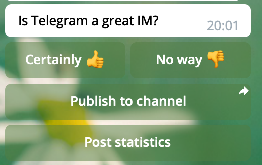
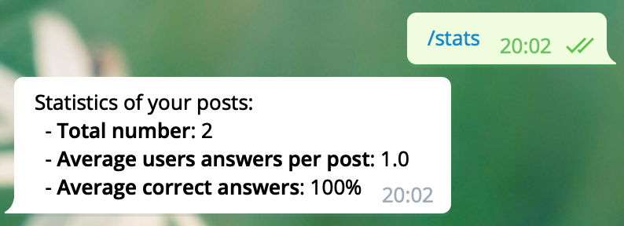

# QuizTelegramBot

## Features:
 - Create new quiz posts right in Telegram
 - Post new quizzes to channels / personal chats
 - View statistics for each post and average
 - Photo/text posts support

## Quiz post example


## Statistics example


## Utils
Bot is written using
 - Awesome [Python-Telegram-Bot](https://github.com/python-telegram-bot/python-telegram-bot) package
 - [MongoDB](https://www.mongodb.com/)
 - Python3

## Setup dev environment
`Dockerfile` / `docker-compose.yml` files are available at the repo, providing
the quizkest way to run the bot locally / on remote server via Docker flow.

Create a file named `.keys` with following content:
```bash
TELEGRAM_TOKEN=<YOUR TOKEN>
```
and run `./build_docker.sh && docker-compose up`

If you want the bot to work behind socks5 proxy, add the following lines to `.keys` file:
```
SOCKS5_PROXY=<SOCKS5 PROXY IP>
SOCKS5_PROXY_USER=<USERNAME>
SOCKS5_PROXY_PASSWORD=<PASSWORD>
```                               

and set `USE_SOCKS5_PROXY` to `true` in `docker-compose.yml`.

## Deploy to production
1. Setup [MongoDB](https://docs.mongodb.com/manual/installation/), or run a cloud provided MongoDB cluster.
2. Symlink systemd config file ```ln -s $(`pwd`) /etc/systemd/system/quizbot.service```
3. Create dedicated user for the bot: `sudo useradd -r -s /bin/false quiz_bot_service`
4. Make sure `/data` directory is writable and has enough space. Alternatively, the data location can be changed in `quizbot.service` file:

   ```
   ...
   Environment=PERSISTENCE_DATA_FILE=/data/quiz_bot_data/persistence.pkl
   ...
   ``` 
   
5. Reload `systemd` daemon: `sudo systemctl daemon-reload`
6. Choose data location for `MongoDB` data, by editing the corresponding config (e.g. `/etc/mongod.conf`)
7. Start services using `systemd`:

   ```
   sudo systemctl restart mongod.service
   sudo systemctl restart quizbot.service
   ```
